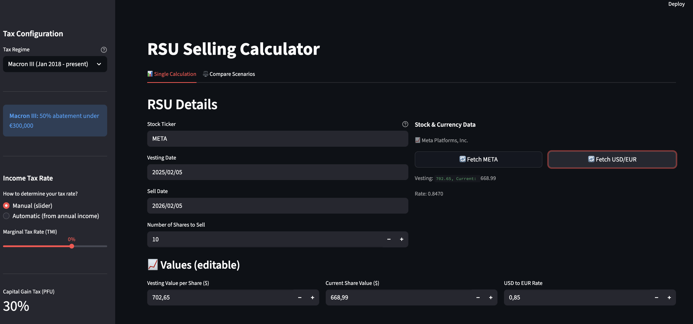

# RSU Selling Calculator

A web-based calculator for estimating taxes when selling Restricted Stock Units (RSUs), specifically designed for Meta shares with French tax rules.



## Features

- **Multiple tax regimes**: Support for Macron I, Macron III, and Unrestricted (non-qualified) plans
- **Customizable stock ticker**: Enter any stock ticker (default: META), supports all Yahoo Finance symbols
- **Auto-fetch stock prices**: Fetches stock prices from Yahoo Finance for vesting and sell dates
- **Auto-fetch exchange rates**: Fetches current USD/EUR conversion rate
- **Regime-specific taper relief**: Automatically calculates abatements based on the selected regime
- **Interactive tooltips**: Hover over any calculated field to see the formula
- **Configurable tax rates**: Adjust income tax rate in the sidebar
- **Override values**: All auto-fetched values can be manually overridden

## Installation

### Prerequisites

- Python 3.10 or higher
- pip (Python package manager)

### Setup

1. Clone the repository:
   ```bash
   git clone <repository-url>
   cd rsu
   ```

2. Create and activate a virtual environment:
   ```bash
   python -m venv venv
   source venv/bin/activate  # On macOS/Linux
   # or
   venv\Scripts\activate  # On Windows
   ```

3. Install dependencies:
   ```bash
   pip install -r requirements.txt
   ```

## Usage

### Running the Calculator

```bash
source venv/bin/activate  # If not already activated
streamlit run rsu_calculator.py
```

The calculator will open in your browser at `http://localhost:8501`.

### Input Fields

| Field | Description |
|-------|-------------|
| **Stock Ticker** | Stock symbol (default: META). Supports any Yahoo Finance ticker (e.g., AAPL, GOOGL, MSFT) |
| **Vesting Date** | Date when the RSU vested |
| **Sell Date** | Date when you plan to sell |
| **Number of Shares** | How many shares to sell |
| **Vesting Value per Share ($)** | Share price at vesting date (auto-fetched) |
| **Current Share Value ($)** | Share price at sell date (auto-fetched) |
| **USD to EUR Rate** | Currency conversion rate (auto-fetched) |

### Tax Configuration (Sidebar)

| Setting | Default | Description |
|---------|---------|-------------|
| **Tax Regime** | Macron III | Select your applicable tax regime |
| **Income Tax Rate** | 30% | Tax rate for acquisition and capital gains |
| **Social Security Rate** | Varies | Automatically set based on regime (17.2% or 9.7%) |

## Tax Regimes

### Which Regime Applies to You?

The regime depends on when your RSUs were **granted** (shareholder approval date):

| Grant Period | Regime |
|--------------|--------|
| Before Aug 7, 2015 | Pre-Macron (not supported) |
| Aug 7, 2015 - Dec 29, 2016 | **Macron I** |
| Dec 30, 2016 - Dec 31, 2017 | Macron II (use Macron I as approximation) |
| Jan 1, 2018 - present | **Macron III** |

If your RSU plan does not comply with French Commercial Code requirements (no French sub-plan), use **Unrestricted**.

### Regime Comparison

| Feature | Macron I | Macron III | Unrestricted |
|---------|----------|------------|--------------|
| **Abatement** | 50% (2-8 yrs) / 65% (8+ yrs) | 50% automatic (under €300k) | None |
| **Social charges** | 17.2% | 17.2% / 9.7% | 9.7% |
| **€300k threshold** | No | Yes | No |
| **10% salariale** | No | Yes (over €300k) | No |
| **Best for** | Long-term holds | Gains under €300k | N/A |

### Macron I (Aug 2015 - Dec 2016)

- **Abatement based on holding period:**
  - 50% if held 2-8 years from vesting
  - 65% if held 8+ years from vesting
- **Social security**: 17.2% (patrimony rate)
- **No salariale contribution**

### Macron III (Jan 2018 - present)

- **Automatic 50% abatement** for acquisition gains under €300,000
- **Over €300,000 threshold:**
  - No abatement
  - Treated as salary income
  - 10% salariale contribution applies
  - Social security at 9.7% (activity rate)
- **Under €300,000:**
  - Social security at 17.2% (patrimony rate)

### Unrestricted (Non-qualified)

- **No abatement** regardless of holding period
- **Social security**: 9.7% (activity rate)
- Fully taxed as salary income

## Tax Calculation Logic

### Formulas

#### Value Conversions
```
Current Share Value (€) = Current Share Value ($) × USD/EUR Rate
Vesting Value (€) = Vesting Value ($) × USD/EUR Rate
```

#### Gains
```
Gross Proceed = Number of Shares × Current Share Value (€)
Acquisition Gain = Number of Shares × Vesting Value (€)
Capital Gain = Gross Proceed - Acquisition Gain
```

#### Taper Relief

| Regime | Condition | Relief Rate |
|--------|-----------|-------------|
| Macron I | Held < 2 years | 0% |
| Macron I | Held 2-8 years | 50% |
| Macron I | Held 8+ years | 65% |
| Macron III | Gain ≤ €300k | 50% |
| Macron III | Gain > €300k | 0% |
| Unrestricted | Always | 0% |

```
Acquisition Gain (after relief) = Acquisition Gain × (1 - Relief Rate)
```

#### Tributable Gain
```
Tributable Gain = Acquisition Gain (after relief) + Capital Gain
```

#### Taxes

| Tax | Formula |
|-----|---------|
| Social Security | Tributable Gain × Social Security Rate |
| Acquisition Tax | Acquisition Gain (after relief) × Income Tax Rate |
| Capital Gain Tax | Capital Gain × Income Tax Rate *(if positive)* |
| Salariale | Acquisition Gain × 10% *(Macron III over €300k only)* |
| **Total** | Sum of all above |

#### Final Results
```
Net in Pocket = Gross Proceed - Total Taxes
Effective Tax Rate = (Total Taxes / Gross Proceed) × 100
```

## Running Tests

The project includes comprehensive unit tests (80 tests) for all calculation functions and regimes.

```bash
# Activate virtual environment
source venv/bin/activate

# Run all tests
pytest test_calculations.py -v

# Run tests with coverage
pytest test_calculations.py --cov=calculations --cov-report=term-missing
```

## Project Structure

```
rsu/
├── rsu_calculator.py    # Main Streamlit application
├── calculations.py      # Core calculation logic (testable)
├── test_calculations.py # Unit tests (80 tests)
├── requirements.txt     # Python dependencies
└── README.md           # This file
```

## Dependencies

| Package | Purpose |
|---------|---------|
| streamlit | Web UI framework |
| python-dateutil | Date manipulation |
| yfinance | Fetch stock prices from Yahoo Finance |
| requests | HTTP requests for exchange rate API |
| pytest | Testing framework |
| pytest-cov | Test coverage reporting |

## Data Sources

- **Stock Prices**: [Yahoo Finance](https://finance.yahoo.com/) via yfinance library
- **Exchange Rates**: [ExchangeRate-API](https://www.exchangerate-api.com/) (free tier)

## References

For more information on French RSU taxation:
- [Fiscaloo - Fiscalité des Actions Gratuites](https://www.fiscaloo.fr/1104-fiscalite-des-actions-gratuites-en-2022-regles-applicables-aux-beneficiaires/)
- [Mingzi - Taxation et fiscalité des actions gratuites](https://www.mingzi.fr/mingzi-actualites/taxation-et-fiscalite-des-actions-gratuites/)
- [Baker McKenzie - Global Equity Matrix (France)](https://resourcehub.bakermckenzie.com/en/resources/global-equity-matrix/emea/france/topics/rsrsu)

## Disclaimer

This calculator is for **estimation purposes only**. Tax calculations may vary based on your specific situation, and tax laws change over time. Always consult with a qualified tax professional for accurate tax advice.

## License

MIT License
